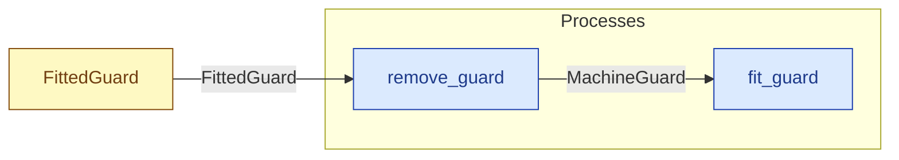

# `remove_guard` — process (R1)

> Generated by `tools/docgen.sh` from `model/pilot-workshop` — **do not hand-edit**; regenerate after any model change. Links are into the defining source lines; Mermaid nodes carry absolute click urls, the legend table the same links as plain markdown.

**Removes the guard (R18): the conserving inverse of [`fit_guard`], returning the unfitted state.**

- **Crate / subsystem:** `pilot-workshop` — the downstream pilot model
- **Source:** [model/pilot-workshop/src/resources.rs#L610](/model/pilot-workshop/src/resources.rs#L610)

## Who and with what

No person in this signature: any time cost is drawn by an **adjacent** draw process in the flow (R15/F-048), or the step needs no actor.

## Inputs

| Parameter | Declared type | Resource kind | Unit | Magnitude |
|---|---|---|---|---|
| `fitted` | `FittedGuard` | reusable (R2) | — | — |

Observed entering this step in the traced flows: `FittedGuard`.

## Outputs

| Output | Resource kind | Unit | Magnitude | Routing (who takes it) |
|---|---|---|---|---|
| `MachineGuard` | reusable (R2) | — | — | `fit_guard` (process) |

Observed leaving this step in the traced flows: `MachineGuard`.

## Where it fits (R9: needs / feeds)

The model states **connections, not sequences**: any order satisfying these dependencies is valid (R9).

**Needs:**

- **FittedGuard** from `FittedGuard` (shared resource)

**Feeds:**

- **MachineGuard** to `fit_guard` (process)

## Neighbourhood (one hop)

### Legend — node → source

| Node | Kind | Defined at |
|---|---|---|
| `n_fit_guard` (fit_guard) | process | [model/pilot-workshop/src/resources.rs#L602](/model/pilot-workshop/src/resources.rs#L602) |
| `n_remove_guard` (remove_guard) | process | [model/pilot-workshop/src/resources.rs#L610](/model/pilot-workshop/src/resources.rs#L610) |
| `n_FittedGuard` (FittedGuard) | shared resource | [model/pilot-workshop/src/resources.rs#L155](/model/pilot-workshop/src/resources.rs#L155) |
