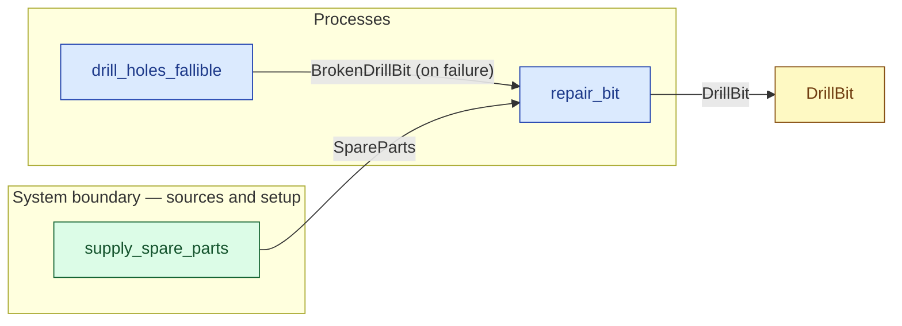

# `repair_bit` — process (R1)

> Generated by `tools/docgen.sh` from `model/pilot-workshop` — **do not hand-edit**; regenerate after any model change. Links are into the defining source lines; Mermaid nodes carry absolute click urls, the legend table the same links as plain markdown.

**Repairs a broken bit with a repair kit (R17): the failure path back to the working state.**

- **Crate / subsystem:** `pilot-workshop` — the downstream pilot model
- **Source:** [model/pilot-workshop/src/resources.rs#L619](/model/pilot-workshop/src/resources.rs#L619)

## Who and with what

No person in this signature: any time cost is drawn by an **adjacent** draw process in the flow (R15/F-048), or the step needs no actor.

## Inputs

| Parameter | Declared type | Resource kind | Unit | Magnitude |
|---|---|---|---|---|
| `broken` | `BrokenDrillBit` | discrete (consumable, R13) | — | — |
| `parts` | `SpareParts` | discrete (consumable, R13) | — | — |

Observed entering this step in the traced flows: `BrokenDrillBit`, `SpareParts`.

## Outputs

| Output | Resource kind | Unit | Magnitude | Routing (who takes it) |
|---|---|---|---|---|
| `DrillBit` | reusable (R2) | — | — | `DrillBit` (shared resource) |

Observed leaving this step in the traced flows: `DrillBit`.

## Where it fits (R9: needs / feeds)

The model states **connections, not sequences**: any order satisfying these dependencies is valid (R9).

**Needs:**

- **BrokenDrillBit (on failure)** from `drill_holes_fallible` (process)
- **SpareParts** from `supply_spare_parts` (boundary source)

**Feeds:**

- **DrillBit** to `DrillBit` (shared resource)

## Neighbourhood (one hop)

### Legend — node → source

| Node | Kind | Defined at |
|---|---|---|
| `n_repair_bit` (repair_bit) | process | [model/pilot-workshop/src/resources.rs#L619](/model/pilot-workshop/src/resources.rs#L619) |
| `n_drill_holes_fallible` (drill_holes_fallible) | process | [model/pilot-workshop/src/resources.rs#L748](/model/pilot-workshop/src/resources.rs#L748) |
| `n_DrillBit` (DrillBit) | shared resource | [model/pilot-workshop/src/resources.rs#L107](/model/pilot-workshop/src/resources.rs#L107) |
| `n_supply_spare_parts` (supply_spare_parts) | boundary source | [model/pilot-workshop/src/resources.rs#L454](/model/pilot-workshop/src/resources.rs#L454) |
