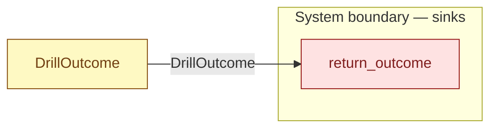

# `return_outcome` — boundary function (R12)

> Generated by `tools/docgen.sh` from `model/pilot-workshop` — **do not hand-edit**; regenerate after any model change. Links are into the defining source lines; Mermaid nodes carry absolute click urls, the legend table the same links as plain markdown.

**One trial of the environment (R17): whether a single fallible drilling attempt succeeds (the bit survives, the plate is drilled) or fails (the bit snaps and ruins the plate).**

- **Crate / subsystem:** `pilot-workshop` — the downstream pilot model
- **Source:** [model/pilot-workshop/src/resources.rs#L185](/model/pilot-workshop/src/resources.rs#L185)

## Who and with what

No person in this signature: any time cost is drawn by an **adjacent** draw process in the flow (R15/F-048), or the step needs no actor.

## Inputs

| Parameter | Declared type | Resource kind | Unit | Magnitude |
|---|---|---|---|---|
| `token` | `DrillOutcome` | outcome token (R17) | — | — |

## Outputs

| Output | Resource kind | Unit | Magnitude | Routing (who takes it) |
|---|---|---|---|---|

## Where it fits (R9: needs / feeds)

The model states **connections, not sequences**: any order satisfying these dependencies is valid (R9).

**Needs:**

- **DrillOutcome** from `DrillOutcome` (shared resource)

## Neighbourhood (one hop)

### Legend — node → source

| Node | Kind | Defined at |
|---|---|---|
| `n_DrillOutcome` (DrillOutcome) | shared resource | [model/pilot-workshop/src/resources.rs#L185](/model/pilot-workshop/src/resources.rs#L185) |
| `n_return_outcome` (return_outcome) | boundary sink | [model/pilot-workshop/src/resources.rs#L185](/model/pilot-workshop/src/resources.rs#L185) |

## Open items (`Placeholder:` tags, R12)

- this function is itself a placeholder (see the header above)
