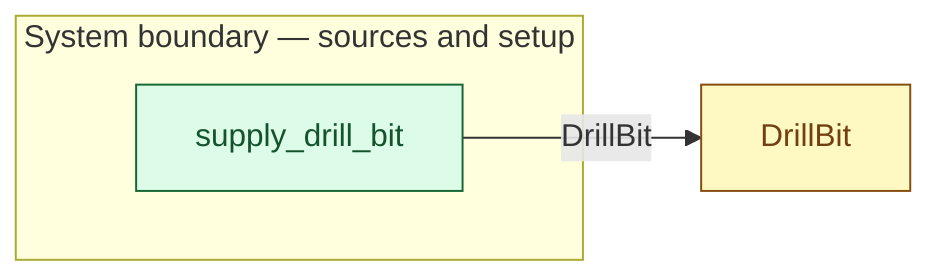

# `supply_drill_bit` — boundary function (R12)

> Generated by `tools/docgen.sh` from `model/pilot-workshop` — **do not hand-edit**; regenerate after any model change. Links are into the defining source lines; Mermaid nodes carry absolute click urls, the legend table the same links as plain markdown.

**A working drill bit enters the model (R12).**

- **Crate / subsystem:** `pilot-workshop` — the downstream pilot model
- **Source:** [model/pilot-workshop/src/resources.rs#L447](/model/pilot-workshop/src/resources.rs#L447)
- **Placeholder:** tool stores — one bit.

## Who and with what

No person in this signature: any time cost is drawn by an **adjacent** draw process in the flow (R15/F-048), or the step needs no actor.

## Inputs

| Parameter | Declared type | Resource kind | Unit | Magnitude |
|---|---|---|---|---|

## Outputs

| Output | Resource kind | Unit | Magnitude | Routing (who takes it) |
|---|---|---|---|---|
| `DrillBit` | reusable (R2) | — | — | `DrillBit` (shared resource) |

## Where it fits (R9: needs / feeds)

The model states **connections, not sequences**: any order satisfying these dependencies is valid (R9).

**Feeds:**

- **DrillBit** to `DrillBit` (shared resource)

## Neighbourhood (one hop)

### Legend — node → source

| Node | Kind | Defined at |
|---|---|---|
| `n_DrillBit` (DrillBit) | shared resource | [model/pilot-workshop/src/resources.rs#L107](/model/pilot-workshop/src/resources.rs#L107) |
| `n_supply_drill_bit` (supply_drill_bit) | boundary source | [model/pilot-workshop/src/resources.rs#L447](/model/pilot-workshop/src/resources.rs#L447) |

## Open items (`Placeholder:` tags, R12)

- this function is itself a placeholder (see the header above)
