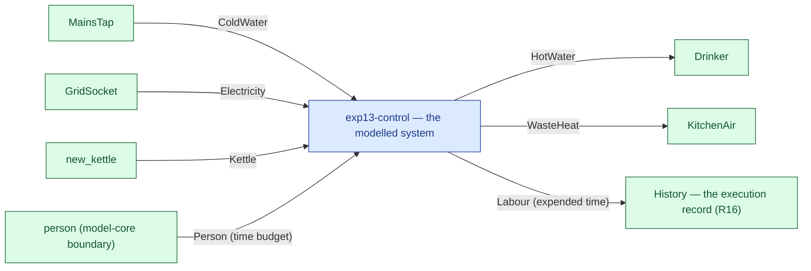

# exp13-control — context diagram

> Generated by `tools/diagram-gen` from `model/exp13-control` — **do not hand-edit**; regenerate with `tools/diagrams.sh`. Diagram nodes are clickable (absolute links into the source); the legend table under the diagram carries the hyperlinks into the source.

The system as one box — only what crosses the boundary (R12/R15): inputs from suppliers and sources on the left-hand edges, outputs to consumers and sinks on the right. Extracted statically from the crate's `boundary` module functions, its `Supplier`/`Consumer` impls and its `outcome_token!` declarations. *exp13-control — the CS-1 slice, hand-written (the control arm)*

## Legend — node → source

| Node | Kind | Defined at |
|---|---|---|
| `n_system` (exp13-control — the modelled system) | the system | [model/exp13-control/src/lib.rs#L1](/model/exp13-control/src/lib.rs#L1) |
| `n_MainsTap` (MainsTap) | external party | [model/exp13-control/src/model.rs#L146](/model/exp13-control/src/model.rs#L146) |
| `n_GridSocket` (GridSocket) | external party | [model/exp13-control/src/model.rs#L155](/model/exp13-control/src/model.rs#L155) |
| `n_new_kettle` (new_kettle) | external party | [model/exp13-control/src/model.rs#L205](/model/exp13-control/src/model.rs#L205) |
| `n_Drinker` (Drinker) | external party | [model/exp13-control/src/model.rs#L182](/model/exp13-control/src/model.rs#L182) |
| `n_KitchenAir` (KitchenAir) | external party | [model/exp13-control/src/model.rs#L164](/model/exp13-control/src/model.rs#L164) |
| `n_person` (person (model-core boundary)) | external party | — |
| `n_history` (History — the execution record (R16)) | external party | — |

## Resources on the edges

| Resource | Kind | Unit | Defined at |
|---|---|---|---|
| `ColdWater` | continuous (container) | grams | [model/exp13-control/src/model.rs#L52](/model/exp13-control/src/model.rs#L52) |
| `Electricity` | continuous (container) | joules | [model/exp13-control/src/model.rs#L60](/model/exp13-control/src/model.rs#L60) |
| `HotWater` | continuous (container) | joules (embodied) | [model/exp13-control/src/model.rs#L103](/model/exp13-control/src/model.rs#L103) |
| `Kettle` | reusable (placeholder) | — | [model/exp13-control/src/model.rs#L78](/model/exp13-control/src/model.rs#L78) |
| `WasteHeat` | continuous (container) | joules | [model/exp13-control/src/model.rs#L68](/model/exp13-control/src/model.rs#L68) |
