# exp13-control — detailed diagram

> Generated by `tools/diagram-gen` from `model/exp13-control` — **do not hand-edit**; regenerate with `tools/diagrams.sh`. Diagram nodes are clickable (absolute links into the source); the legend table under the diagram carries the hyperlinks into the source.

All levels, fully connected: every call in the flow — boundary setup, the processes, the adjacent time draws and their `History` records (F-048/R16), internal waste routing, and the disposal steps — traced from the flow function's `let`-binding sequence, with the const magnitudes from each call site. Edge labels carry the resource and its magnitude in the base unit (R7).

## Test flow — `flow_makes_hot_water_and_accounts_for_everything`

Source: [model/exp13-control/tests/flows.rs#L28](/model/exp13-control/tests/flows.rs#L28)

```mermaid
flowchart LR
  classDef process fill:#dbeafe,stroke:#1e40af,color:#1e3a8a;
  classDef boundary fill:#dcfce7,stroke:#166534,color:#14532d;
  classDef sink fill:#fee2e2,stroke:#991b1b,color:#7f1d1d;
  classDef helper fill:#f3e8ff,stroke:#6b21a8,color:#581c87;
  classDef grouping fill:#ffedd5,stroke:#9a3412,color:#7c2d12;
  classDef flowio fill:#e2e8f0,stroke:#334155,color:#0f172a;
  classDef resource fill:#fef9c3,stroke:#854d0e,color:#713f12;
  classDef external fill:#dcfce7,stroke:#166534,color:#14532d;
  classDef system fill:#dbeafe,stroke:#1e40af,color:#1e3a8a;
  subgraph sg_sources["System boundary — sources and setup"]
    direction TB
    n_new_person["new_person"]:::boundary
    n_new_mains_tap["new_mains_tap"]:::boundary
    n_new_grid_socket["new_grid_socket"]:::boundary
    n_draw_cold_water["draw_cold_water"]:::boundary
    n_new_kettle["new_kettle"]:::boundary
    n_draw_grid_energy["draw_grid_energy"]:::boundary
  end
  subgraph sg_system["Processes"]
    direction TB
    n_fill_kettle["fill_kettle"]:::process
    n_boil["boil"]:::process
    n_pour_cuppa["pour_cuppa"]:::process
  end
  subgraph sg_helpers["Time accounting and helpers (model-core)"]
    direction TB
    n_new_history["new_history"]:::helper
    n_draw_time["draw_time"]:::helper
    n_record["record fill_kettle"]:::helper
  end
  subgraph sg_sinks["System boundary — sinks"]
    direction TB
    n_new_kitchen_air["new_kitchen_air"]:::sink
    n_new_drinker["new_drinker"]:::sink
  end
  n_flow_end["flow end — everything accounted"]:::flowio
  n_new_mains_tap -- "MainsTap" --> n_draw_cold_water
  n_new_person -- "Person 300000 ms" --> n_fill_kettle
  n_new_kettle -- "Kettle" --> n_fill_kettle
  n_draw_cold_water -- "ColdWater 1500 grams" --> n_fill_kettle
  n_fill_kettle -- "Person 300000 ms" --> n_draw_time
  n_new_history -- "History" --> n_record
  n_draw_time -- "Labour 30000 ms" --> n_record
  n_new_grid_socket -- "GridSocket" --> n_draw_grid_energy
  n_fill_kettle -- "FilledKettle" --> n_boil
  n_draw_grid_energy -- "Electricity 550000 joules" --> n_boil
  n_boil -- "WasteHeat 50000 joules" --> n_new_kitchen_air
  n_boil -- "BoilingKettle 1500, 500000 joules" --> n_pour_cuppa
  n_pour_cuppa -- "HotWater 1500, 490000 joules" --> n_new_drinker
  n_pour_cuppa -- "WasteHeat 10000 joules" --> n_new_kitchen_air
  n_draw_time -- "Person 270000 ms" --> n_flow_end
  n_draw_cold_water -- "MainsTap" --> n_flow_end
  n_draw_grid_energy -- "GridSocket" --> n_flow_end
  n_pour_cuppa -- "Kettle" --> n_flow_end
  n_new_kitchen_air -- "KitchenAir" --> n_flow_end
  n_new_drinker -- "Drinker" --> n_flow_end
  n_record -- "History" --> n_flow_end
  click n_new_mains_tap "/model/exp13-control/src/model.rs#L212" "model/exp13-control/src/model.rs"
  click n_new_grid_socket "/model/exp13-control/src/model.rs#L219" "model/exp13-control/src/model.rs"
  click n_new_kitchen_air "/model/exp13-control/src/model.rs#L225" "model/exp13-control/src/model.rs"
  click n_new_drinker "/model/exp13-control/src/model.rs#L230" "model/exp13-control/src/model.rs"
  click n_draw_cold_water "/model/exp13-control/src/model.rs#L239" "model/exp13-control/src/model.rs"
  click n_new_kettle "/model/exp13-control/src/model.rs#L205" "model/exp13-control/src/model.rs"
  click n_fill_kettle "/model/exp13-control/src/model.rs#L266" "model/exp13-control/src/model.rs"
  click n_draw_grid_energy "/model/exp13-control/src/model.rs#L247" "model/exp13-control/src/model.rs"
  click n_boil "/model/exp13-control/src/model.rs#L300" "model/exp13-control/src/model.rs"
  click n_pour_cuppa "/model/exp13-control/src/model.rs#L329" "model/exp13-control/src/model.rs"
  click n_flow_end "/model/exp13-control/tests/flows.rs#L28" "model/exp13-control/tests/flows.rs"
```

### Legend — node → source

| Node | Kind | Defined at |
|---|---|---|
| `n_new_history` (new_history) | model-core helper | — |
| `n_new_person` (new_person) | boundary source | — |
| `n_new_mains_tap` (new_mains_tap) | boundary source | [model/exp13-control/src/model.rs#L212](/model/exp13-control/src/model.rs#L212) |
| `n_new_grid_socket` (new_grid_socket) | boundary source | [model/exp13-control/src/model.rs#L219](/model/exp13-control/src/model.rs#L219) |
| `n_new_kitchen_air` (new_kitchen_air) | boundary sink | [model/exp13-control/src/model.rs#L225](/model/exp13-control/src/model.rs#L225) |
| `n_new_drinker` (new_drinker) | boundary sink | [model/exp13-control/src/model.rs#L230](/model/exp13-control/src/model.rs#L230) |
| `n_draw_cold_water` (draw_cold_water) | boundary source | [model/exp13-control/src/model.rs#L239](/model/exp13-control/src/model.rs#L239) |
| `n_new_kettle` (new_kettle) | boundary source | [model/exp13-control/src/model.rs#L205](/model/exp13-control/src/model.rs#L205) |
| `n_fill_kettle` (fill_kettle) | process | [model/exp13-control/src/model.rs#L266](/model/exp13-control/src/model.rs#L266) |
| `n_draw_time` (draw_time) | model-core helper | — |
| `n_record` (record fill_kettle) | model-core helper | — |
| `n_draw_grid_energy` (draw_grid_energy) | boundary source | [model/exp13-control/src/model.rs#L247](/model/exp13-control/src/model.rs#L247) |
| `n_boil` (boil) | process | [model/exp13-control/src/model.rs#L300](/model/exp13-control/src/model.rs#L300) |
| `n_pour_cuppa` (pour_cuppa) | process | [model/exp13-control/src/model.rs#L329](/model/exp13-control/src/model.rs#L329) |
| `n_flow_end` (flow end — everything accounted) | flow input/output | [model/exp13-control/tests/flows.rs#L28](/model/exp13-control/tests/flows.rs#L28) |

## Resources on the edges

| Resource | Kind | Unit | Defined at |
|---|---|---|---|
| `BoilingKettle` | continuous (container) | joules (embodied) | [model/exp13-control/src/model.rs#L95](/model/exp13-control/src/model.rs#L95) |
| `ColdWater` | continuous (container) | grams | [model/exp13-control/src/model.rs#L52](/model/exp13-control/src/model.rs#L52) |
| `Drinker` | boundary object (placeholder) | — | [model/exp13-control/src/model.rs#L182](/model/exp13-control/src/model.rs#L182) |
| `Electricity` | continuous (container) | joules | [model/exp13-control/src/model.rs#L60](/model/exp13-control/src/model.rs#L60) |
| `FilledKettle` | continuous (container) | grams of water | [model/exp13-control/src/model.rs#L86](/model/exp13-control/src/model.rs#L86) |
| `GridSocket` | reusable (placeholder) | — | [model/exp13-control/src/model.rs#L155](/model/exp13-control/src/model.rs#L155) |
| `HotWater` | continuous (container) | joules (embodied) | [model/exp13-control/src/model.rs#L103](/model/exp13-control/src/model.rs#L103) |
| `Kettle` | reusable (placeholder) | — | [model/exp13-control/src/model.rs#L78](/model/exp13-control/src/model.rs#L78) |
| `KitchenAir` | boundary object (placeholder) | — | [model/exp13-control/src/model.rs#L164](/model/exp13-control/src/model.rs#L164) |
| `MainsTap` | reusable (placeholder) | — | [model/exp13-control/src/model.rs#L146](/model/exp13-control/src/model.rs#L146) |
| `WasteHeat` | continuous (container) | joules | [model/exp13-control/src/model.rs#L68](/model/exp13-control/src/model.rs#L68) |
