# exp13-control — top-level diagram

> Generated by `tools/diagram-gen` from `model/exp13-control` — **do not hand-edit**; regenerate with `tools/diagrams.sh`. Diagram nodes are clickable (absolute links into the source); the legend table under the diagram carries the hyperlinks into the source.

The first level of processes with their inputs and outputs, linked to each other and to the boundary. This is the **R9 connection graph**, extracted statically from the process signatures (the model describes connections, not sequences): an edge `A — T → B` means A outputs a resource of type T that B's signature accepts. Requirement-trait bounds are resolved through their `satisfies!`-tagged types; `Consumer`/`SupplyN` bounds become sink/supplier edges. Dashed links are reusable resources or boundary objects **threaded** through a process (moved in and returned, R2) — no direction is claimed. Hand-overs that happen inside a process (e.g. a sealed disposal minting its output) are not visible in signatures and appear only in the detailed diagram's flow trace.

```mermaid
flowchart LR
  classDef process fill:#dbeafe,stroke:#1e40af,color:#1e3a8a;
  classDef boundary fill:#dcfce7,stroke:#166534,color:#14532d;
  classDef sink fill:#fee2e2,stroke:#991b1b,color:#7f1d1d;
  classDef helper fill:#f3e8ff,stroke:#6b21a8,color:#581c87;
  classDef grouping fill:#ffedd5,stroke:#9a3412,color:#7c2d12;
  classDef flowio fill:#e2e8f0,stroke:#334155,color:#0f172a;
  classDef resource fill:#fef9c3,stroke:#854d0e,color:#713f12;
  classDef external fill:#dcfce7,stroke:#166534,color:#14532d;
  classDef system fill:#dbeafe,stroke:#1e40af,color:#1e3a8a;
  subgraph sg_sources["System boundary — sources and setup"]
    direction TB
    n_draw_cold_water["draw_cold_water"]:::boundary
    n_draw_grid_energy["draw_grid_energy"]:::boundary
    n_new_grid_socket["new_grid_socket"]:::boundary
    n_new_kettle["new_kettle"]:::boundary
    n_new_mains_tap["new_mains_tap"]:::boundary
    n_new_person["new_person (model-core)"]:::boundary
  end
  subgraph sg_system["Processes"]
    direction TB
    n_fill_kettle["fill_kettle"]:::process
    n_boil["boil"]:::process
    n_pour_cuppa["pour_cuppa"]:::process
  end
  subgraph sg_sinks["System boundary — sinks"]
    direction TB
    n_Drinker["Drinker"]:::sink
    n_KitchenAir["KitchenAir"]:::sink
  end
  n_Person["Person"]:::resource
  n_boil -- "BoilingKettle" --> n_pour_cuppa
  n_draw_cold_water -- "ColdWater" --> n_fill_kettle
  n_draw_grid_energy -- "Electricity" --> n_boil
  n_fill_kettle -- "FilledKettle" --> n_boil
  n_new_grid_socket -- "GridSocket" --> n_draw_grid_energy
  n_pour_cuppa -- "HotWater" --> n_Drinker
  n_pour_cuppa -- "Kettle" --> n_fill_kettle
  n_new_kettle -- "Kettle" --> n_fill_kettle
  n_new_mains_tap -- "MainsTap" --> n_draw_cold_water
  n_boil -- "WasteHeat" --> n_KitchenAir
  n_pour_cuppa -- "WasteHeat" --> n_KitchenAir
  n_Person -.- n_fill_kettle
  n_new_person -- "Person" --> n_Person
  click n_fill_kettle "/model/exp13-control/src/model.rs#L266" "model/exp13-control/src/model.rs"
  click n_boil "/model/exp13-control/src/model.rs#L300" "model/exp13-control/src/model.rs"
  click n_pour_cuppa "/model/exp13-control/src/model.rs#L329" "model/exp13-control/src/model.rs"
  click n_draw_cold_water "/model/exp13-control/src/model.rs#L239" "model/exp13-control/src/model.rs"
  click n_draw_grid_energy "/model/exp13-control/src/model.rs#L247" "model/exp13-control/src/model.rs"
  click n_new_grid_socket "/model/exp13-control/src/model.rs#L219" "model/exp13-control/src/model.rs"
  click n_Drinker "/model/exp13-control/src/model.rs#L182" "model/exp13-control/src/model.rs"
  click n_new_kettle "/model/exp13-control/src/model.rs#L205" "model/exp13-control/src/model.rs"
  click n_new_mains_tap "/model/exp13-control/src/model.rs#L212" "model/exp13-control/src/model.rs"
  click n_KitchenAir "/model/exp13-control/src/model.rs#L164" "model/exp13-control/src/model.rs"
```

## Legend — node → source

| Node | Kind | Defined at |
|---|---|---|
| `n_fill_kettle` (fill_kettle) | process | [model/exp13-control/src/model.rs#L266](/model/exp13-control/src/model.rs#L266) |
| `n_boil` (boil) | process | [model/exp13-control/src/model.rs#L300](/model/exp13-control/src/model.rs#L300) |
| `n_pour_cuppa` (pour_cuppa) | process | [model/exp13-control/src/model.rs#L329](/model/exp13-control/src/model.rs#L329) |
| `n_draw_cold_water` (draw_cold_water) | boundary source | [model/exp13-control/src/model.rs#L239](/model/exp13-control/src/model.rs#L239) |
| `n_draw_grid_energy` (draw_grid_energy) | boundary source | [model/exp13-control/src/model.rs#L247](/model/exp13-control/src/model.rs#L247) |
| `n_new_grid_socket` (new_grid_socket) | boundary source | [model/exp13-control/src/model.rs#L219](/model/exp13-control/src/model.rs#L219) |
| `n_Drinker` (Drinker) | boundary sink | [model/exp13-control/src/model.rs#L182](/model/exp13-control/src/model.rs#L182) |
| `n_new_kettle` (new_kettle) | boundary source | [model/exp13-control/src/model.rs#L205](/model/exp13-control/src/model.rs#L205) |
| `n_new_mains_tap` (new_mains_tap) | boundary source | [model/exp13-control/src/model.rs#L212](/model/exp13-control/src/model.rs#L212) |
| `n_KitchenAir` (KitchenAir) | boundary sink | [model/exp13-control/src/model.rs#L164](/model/exp13-control/src/model.rs#L164) |
| `n_Person` (Person) | shared resource | — |
| `n_new_person` (new_person (model-core)) | boundary source | — |

## Resources on the edges

| Resource | Kind | Unit | Defined at |
|---|---|---|---|
| `BoilingKettle` | continuous (container) | joules (embodied) | [model/exp13-control/src/model.rs#L95](/model/exp13-control/src/model.rs#L95) |
| `ColdWater` | continuous (container) | grams | [model/exp13-control/src/model.rs#L52](/model/exp13-control/src/model.rs#L52) |
| `Electricity` | continuous (container) | joules | [model/exp13-control/src/model.rs#L60](/model/exp13-control/src/model.rs#L60) |
| `FilledKettle` | continuous (container) | grams of water | [model/exp13-control/src/model.rs#L86](/model/exp13-control/src/model.rs#L86) |
| `GridSocket` | reusable (placeholder) | — | [model/exp13-control/src/model.rs#L155](/model/exp13-control/src/model.rs#L155) |
| `HotWater` | continuous (container) | joules (embodied) | [model/exp13-control/src/model.rs#L103](/model/exp13-control/src/model.rs#L103) |
| `Kettle` | reusable (placeholder) | — | [model/exp13-control/src/model.rs#L78](/model/exp13-control/src/model.rs#L78) |
| `MainsTap` | reusable (placeholder) | — | [model/exp13-control/src/model.rs#L146](/model/exp13-control/src/model.rs#L146) |
| `WasteHeat` | continuous (container) | joules | [model/exp13-control/src/model.rs#L68](/model/exp13-control/src/model.rs#L68) |
