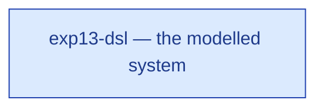

# exp13-dsl — context diagram

> Generated by `tools/diagram-gen` from `model/exp13-dsl` — **do not hand-edit**; regenerate with `tools/diagrams.sh`. Diagram nodes are clickable (absolute links into the source); the legend table under the diagram carries the hyperlinks into the source.

The system as one box — only what crosses the boundary (R12/R15): inputs from suppliers and sources on the left-hand edges, outputs to consumers and sinks on the right. Extracted statically from the crate's `boundary` module functions, its `Supplier`/`Consumer` impls and its `outcome_token!` declarations. *exp13-dsl — the CS-1 slice authored through the `model!` macro front-end*

## Legend — node → source

| Node | Kind | Defined at |
|---|---|---|
| `n_system` (exp13-dsl — the modelled system) | the system | [model/exp13-dsl/src/lib.rs#L1](/model/exp13-dsl/src/lib.rs#L1) |
