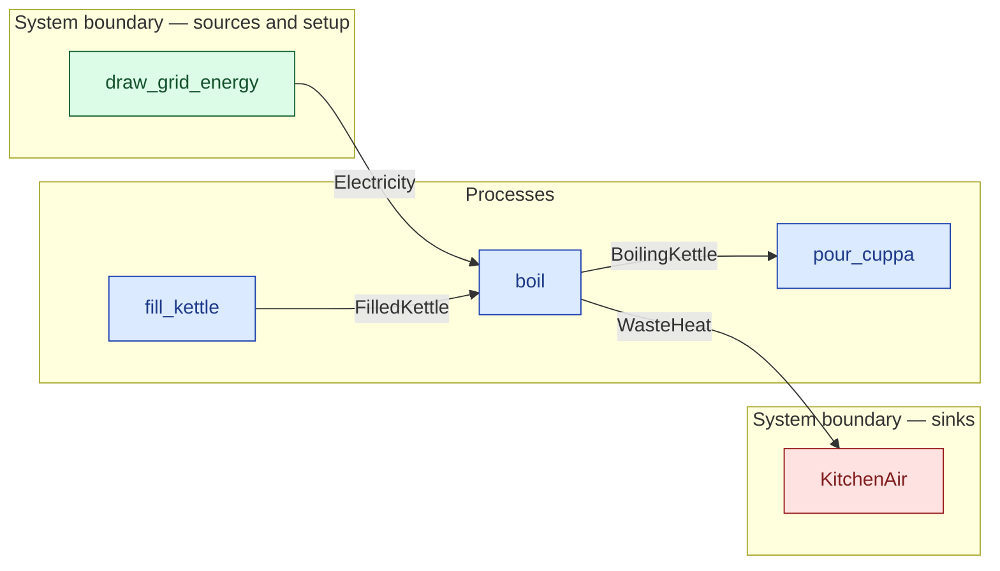

# `boil` — process (R1)

> Generated by `tools/docgen.sh` from `model/exp13-control` — **do not hand-edit**; regenerate after any model change. Links are into the defining source lines; Mermaid nodes carry absolute click urls, the legend table the same links as plain markdown.

**P3 — boils the kettle: the filled kettle plus `DRAW_J` joules from the grid become the boiling kettle (same water mass `G`, `EMBODIED_J` embodied) plus `HEAT_J` of kettle-loss waste heat.**

- **Crate / subsystem:** `exp13-control` — the CS-1 slice, hand-written (the control arm)
- **Source:** [model/exp13-control/src/model.rs#L300](/model/exp13-control/src/model.rs#L300)

## Who and with what

No person in this signature: any time cost is drawn by an **adjacent** draw process in the flow (R15/F-048), or the step needs no actor.

## Inputs

| Parameter | Declared type | Resource kind | Unit | Magnitude |
|---|---|---|---|---|
| `kettle` | `FilledKettle<G>` | continuous (container, R15) | grams of water | `G` (caller-stated) |
| `energy` | `Electricity<DRAW_J>` | continuous (container, R15) | joules | `DRAW_J` (caller-stated) |

Observed entering this step in the traced flows: `Electricity 550000 joules`, `FilledKettle`.

## Outputs

| Output | Resource kind | Unit | Magnitude | Routing (who takes it) |
|---|---|---|---|---|
| `BoilingKettle<G, EMBODIED_J>` | continuous (container, R15) | joules (embodied) | `G` (caller-stated), `EMBODIED_J` (caller-stated) | `pour_cuppa` (process) |
| `WasteHeat<HEAT_J>` | continuous (container, R15) | joules | `HEAT_J` (caller-stated) | `KitchenAir` (boundary sink) |

Observed leaving this step in the traced flows: `BoilingKettle 1500, 500000 joules`, `WasteHeat 50000 joules`.

## Balances (R1/R3/R15)

- **Compile-time assert:** `EMBODIED_J + HEAT_J == DRAW_J`
  - message: *energy conservation violated in boil (R15): the embodied energy plus the kettle's waste heat must sum exactly to the energy drawn from the grid*
  - in numbers (observed instantiation): `500000 + 50000 == 550000` → 550000 = 550000 (holds)
  - fires at monomorphization (F-001): `cargo build`/`cargo test` catch a violation; `cargo check` and editor diagnostics do not.
- **Structural:** the const parameter `G` appears in an input and an output — the magnitude flows through unchanged, checked by the shared type parameter (no assert needed).

## Where it fits (R9: needs / feeds)

The model states **connections, not sequences**: any order satisfying these dependencies is valid (R9).

**Needs:**

- **Electricity** from `draw_grid_energy` (boundary source)
- **FilledKettle** from `fill_kettle` (process)

**Feeds:**

- **BoilingKettle** to `pour_cuppa` (process)
- **WasteHeat** to `KitchenAir` (boundary sink)

## Neighbourhood (one hop)

### Legend — node → source

| Node | Kind | Defined at |
|---|---|---|
| `n_fill_kettle` (fill_kettle) | process | [model/exp13-control/src/model.rs#L266](/model/exp13-control/src/model.rs#L266) |
| `n_boil` (boil) | process | [model/exp13-control/src/model.rs#L300](/model/exp13-control/src/model.rs#L300) |
| `n_pour_cuppa` (pour_cuppa) | process | [model/exp13-control/src/model.rs#L329](/model/exp13-control/src/model.rs#L329) |
| `n_draw_grid_energy` (draw_grid_energy) | boundary source | [model/exp13-control/src/model.rs#L247](/model/exp13-control/src/model.rs#L247) |
| `n_KitchenAir` (KitchenAir) | boundary sink | [model/exp13-control/src/model.rs#L164](/model/exp13-control/src/model.rs#L164) |
