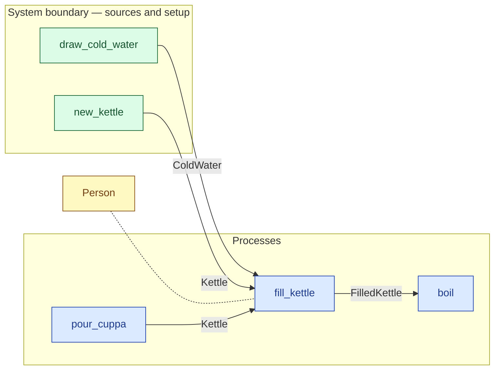

# `fill_kettle` — process (R1)

> Generated by `tools/docgen.sh` from `model/exp13-control` — **do not hand-edit**; regenerate after any model change. Links are into the defining source lines; Mermaid nodes carry absolute click urls, the legend table the same links as plain markdown.

**P1 — fills the kettle with the drawn cold water.**

- **Crate / subsystem:** `exp13-control` — the CS-1 slice, hand-written (the control arm)
- **Source:** [model/exp13-control/src/model.rs#L266](/model/exp13-control/src/model.rs#L266)

## Who and with what

| Actor | Type | Budget at entry | This step's adjacent draw (F-048) |
|---|---|---|---|
| `person` | `Person` | `B` (caller-stated) | 30000 ms |

## Inputs

| Parameter | Declared type | Resource kind | Unit | Magnitude |
|---|---|---|---|---|
| `person` | `Person<B>` | reusable (model-core, R2/R15) | ms | `B` (caller-stated) |
| `kettle` | `Kettle` | reusable (R2) | — | — |
| `water` | `ColdWater<G>` | continuous (container, R15) | grams | `G` (caller-stated) |

Observed entering this step in the traced flows: `ColdWater 1500 grams`, `Kettle`, `Person 300000 ms`.

## Outputs

| Output | Resource kind | Unit | Magnitude | Routing (who takes it) |
|---|---|---|---|---|
| `Person<B>` | reusable (model-core, R2/R15) | ms | `B` (caller-stated) | moved in and returned (R2) |
| `FilledKettle<G>` | continuous (container, R15) | grams of water | `G` (caller-stated) | `boil` (process) |

Observed leaving this step in the traced flows: `FilledKettle`, `Person 300000 ms`.

## Balances (R1/R3/R15)

- **Structural:** the const parameter `B` appears in an input and an output — the magnitude flows through unchanged, checked by the shared type parameter (no assert needed).
- **Structural:** the const parameter `G` appears in an input and an output — the magnitude flows through unchanged, checked by the shared type parameter (no assert needed).

## Where it fits (R9: needs / feeds)

The model states **connections, not sequences**: any order satisfying these dependencies is valid (R9).

**Needs:**

- **ColdWater** from `draw_cold_water` (boundary source)
- **Kettle** from `new_kettle` (boundary source)
- **Kettle** from `pour_cuppa` (process)
- `Person` (shared resource) — threaded through, returned (R2)

**Feeds:**

- **FilledKettle** to `boil` (process)

## Neighbourhood (one hop)

### Legend — node → source

| Node | Kind | Defined at |
|---|---|---|
| `n_fill_kettle` (fill_kettle) | process | [model/exp13-control/src/model.rs#L266](/model/exp13-control/src/model.rs#L266) |
| `n_boil` (boil) | process | [model/exp13-control/src/model.rs#L300](/model/exp13-control/src/model.rs#L300) |
| `n_pour_cuppa` (pour_cuppa) | process | [model/exp13-control/src/model.rs#L329](/model/exp13-control/src/model.rs#L329) |
| `n_draw_cold_water` (draw_cold_water) | boundary source | [model/exp13-control/src/model.rs#L239](/model/exp13-control/src/model.rs#L239) |
| `n_new_kettle` (new_kettle) | boundary source | [model/exp13-control/src/model.rs#L205](/model/exp13-control/src/model.rs#L205) |
| `n_Person` (Person) | shared resource | — |

## Open items (`Placeholder:` tags, R12)

- `Kettle` — kitchen setup at flow start — one kettle. ([model/exp13-control/src/model.rs#L78](/model/exp13-control/src/model.rs#L78))
