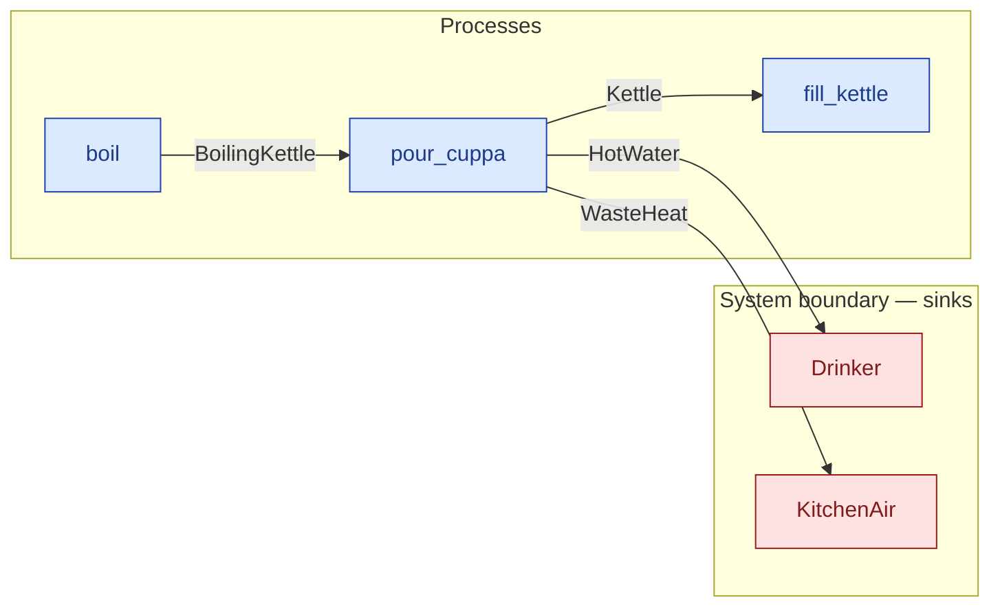

# `pour_cuppa` — process (R1)

> Generated by `tools/docgen.sh` from `model/exp13-control` — **do not hand-edit**; regenerate after any model change. Links are into the defining source lines; Mermaid nodes carry absolute click urls, the legend table the same links as plain markdown.

**P4 — pours the kettle at the boil into the cup: REQ-001 on the kettle (only the boiling state pours; the wrong state fails with the REQ-phrased `on_unimplemented` message, F-044).**

- **Crate / subsystem:** `exp13-control` — the CS-1 slice, hand-written (the control arm)
- **Source:** [model/exp13-control/src/model.rs#L329](/model/exp13-control/src/model.rs#L329)
- **Requirements bound on the signature:** REQ-001

## Who and with what

No person in this signature: any time cost is drawn by an **adjacent** draw process in the flow (R15/F-048), or the step needs no actor.

## Inputs

| Parameter | Declared type | Resource kind | Unit | Magnitude |
|---|---|---|---|---|
| `kettle` | `K` → `BoilingKettle` (via the requirement bound) | continuous (container, R15) | joules (embodied) | — |

Observed entering this step in the traced flows: `BoilingKettle 1500, 500000 joules`.

## Outputs

| Output | Resource kind | Unit | Magnitude | Routing (who takes it) |
|---|---|---|---|---|
| `Kettle` | reusable (R2) | — | — | `fill_kettle` (process) |
| `HotWater<OUT_G, OUT_E>` | continuous (container, R15) | joules (embodied) | `OUT_G` (caller-stated), `OUT_E` (caller-stated) | `Drinker` (boundary sink) |
| `WasteHeat<LOSS_J>` | continuous (container, R15) | joules | `LOSS_J` (caller-stated) | `KitchenAir` (boundary sink) |

Observed leaving this step in the traced flows: `HotWater 1500, 490000 joules`, `Kettle`, `WasteHeat 10000 joules`.

## Balances (R1/R3/R15)

- **Compile-time assert:** `K::WATER_G == OUT_G`
  - message: *mass conservation violated in pour_cuppa (R3): the hot water poured must carry exactly the boiling water's mass*
  - fires at monomorphization (F-001): `cargo build`/`cargo test` catch a violation; `cargo check` and editor diagnostics do not.
- **Compile-time assert:** `K::EMBODIED_J == OUT_E + LOSS_J`
  - message: *energy conservation violated in pour_cuppa (R15): the kettle's embodied energy must sum exactly to the hot water's embodied energy plus the pouring loss*
  - fires at monomorphization (F-001): `cargo build`/`cargo test` catch a violation; `cargo check` and editor diagnostics do not.

## Requirements (R10 — the compliance matrix)

| Requirement | Statement | Defined at | Satisfied by | Verified by |
|---|---|---|---|---|
| REQ-001 | Tea must be brewed with boiling water (only the boiling state of the kettle can be poured). | [model/exp13-control/src/model.rs#L41](/model/exp13-control/src/model.rs#L41) | `KettleAtTheBoil` | [`pour_cuppa_balances_mass_and_energy`](/model/exp13-control/src/model.rs#L393), [`flow_makes_hot_water_and_accounts_for_everything`](/model/exp13-control/tests/flows.rs#L28) |

This item is doc-tagged `Satisfies: REQ-001`.

## Where it fits (R9: needs / feeds)

The model states **connections, not sequences**: any order satisfying these dependencies is valid (R9).

**Needs:**

- **BoilingKettle** from `boil` (process)

**Feeds:**

- **HotWater** to `Drinker` (boundary sink)
- **Kettle** to `fill_kettle` (process)
- **WasteHeat** to `KitchenAir` (boundary sink)

## Neighbourhood (one hop)

### Legend — node → source

| Node | Kind | Defined at |
|---|---|---|
| `n_fill_kettle` (fill_kettle) | process | [model/exp13-control/src/model.rs#L266](/model/exp13-control/src/model.rs#L266) |
| `n_boil` (boil) | process | [model/exp13-control/src/model.rs#L300](/model/exp13-control/src/model.rs#L300) |
| `n_pour_cuppa` (pour_cuppa) | process | [model/exp13-control/src/model.rs#L329](/model/exp13-control/src/model.rs#L329) |
| `n_Drinker` (Drinker) | boundary sink | [model/exp13-control/src/model.rs#L182](/model/exp13-control/src/model.rs#L182) |
| `n_KitchenAir` (KitchenAir) | boundary sink | [model/exp13-control/src/model.rs#L164](/model/exp13-control/src/model.rs#L164) |

## Open items (`Placeholder:` tags, R12)

- `Kettle` — kitchen setup at flow start — one kettle. ([model/exp13-control/src/model.rs#L78](/model/exp13-control/src/model.rs#L78))
