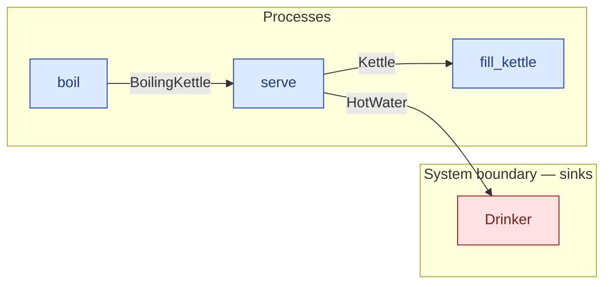

# `serve` — process (R1)

> Generated by `tools/docgen.sh` from `model/cs1-slice` — **do not hand-edit**; regenerate after any model change. Links are into the defining source lines; Mermaid nodes carry absolute click urls, the legend table the same links as plain markdown.

**Pours the boiling kettle out for the drinker; only a kettle at the boil may be served (REQ-001).**

- **Crate / subsystem:** `cs1-slice` — generated model crate (EXP-14)
- **Source:** [model/cs1-slice/src/resources.rs#L272](/model/cs1-slice/src/resources.rs#L272)
- **Requirements bound on the signature:** REQ-001

## Who and with what

No person in this signature: any time cost is drawn by an **adjacent** draw process in the flow (R15/F-048), or the step needs no actor.
Adjacent draw observed in the traced flows for this step: **15000 ms**.

## Inputs

| Parameter | Declared type | Resource kind | Unit | Magnitude |
|---|---|---|---|---|
| `kettle` | `K` → `BoilingKettle` (via the requirement bound) | continuous (container, R15) | joules (embodied) | — |

Observed entering this step in the traced flows: `BoilingKettle 1500, 500000 joules`.

## Outputs

| Output | Resource kind | Unit | Magnitude | Routing (who takes it) |
|---|---|---|---|---|
| `Kettle` | reusable (R2) | — | — | `fill_kettle` (process) |
| `HotWater<MASS_G, SERVED_J>` | continuous (container, R15) | joules (embodied) | `MASS_G` (caller-stated), `SERVED_J` (caller-stated) | `Drinker` (boundary sink) |

Observed leaving this step in the traced flows: `HotWater 1500, 500000 joules`, `Kettle`.

## Balances (R1/R3/R15)

- **Compile-time assert:** `K::WATER_G == MASS_G`
  - message: *mass conservation violated in serve (R3): K.WATER_G must equal MASS_G - the amounts entering serve must sum exactly to the amounts leaving it*
  - fires at monomorphization (F-001): `cargo build`/`cargo test` catch a violation; `cargo check` and editor diagnostics do not.
- **Compile-time assert:** `K::EMBODIED_J == SERVED_J`
  - message: *energy conservation violated in serve (R15): K.EMBODIED_J must equal SERVED_J - the amounts entering serve must sum exactly to the amounts leaving it*
  - fires at monomorphization (F-001): `cargo build`/`cargo test` catch a violation; `cargo check` and editor diagnostics do not.

## Requirements (R10 — the compliance matrix)

| Requirement | Statement | Defined at | Satisfied by | Verified by |
|---|---|---|---|---|
| REQ-001 | Water must be poured at the boil (only the boiling state of the kettle can be served). | [model/cs1-slice/src/requirements.rs#L15](/model/cs1-slice/src/requirements.rs#L15) | `KettleAtTheBoil` | [`flow_make_tea_accounts_for_everything`](/model/cs1-slice/tests/flows.rs#L13) |

This item is doc-tagged `Satisfies: REQ-001`.

## Where it fits (R9: needs / feeds)

The model states **connections, not sequences**: any order satisfying these dependencies is valid (R9).

**Needs:**

- **BoilingKettle** from `boil` (process)

**Feeds:**

- **HotWater** to `Drinker` (boundary sink)
- **Kettle** to `fill_kettle` (process)

## Neighbourhood (one hop)

### Legend — node → source

| Node | Kind | Defined at |
|---|---|---|
| `n_fill_kettle` (fill_kettle) | process | [model/cs1-slice/src/resources.rs#L237](/model/cs1-slice/src/resources.rs#L237) |
| `n_boil` (boil) | process | [model/cs1-slice/src/resources.rs#L252](/model/cs1-slice/src/resources.rs#L252) |
| `n_serve` (serve) | process | [model/cs1-slice/src/resources.rs#L272](/model/cs1-slice/src/resources.rs#L272) |
| `n_Drinker` (Drinker) | boundary sink | [model/cs1-slice/src/resources.rs#L112](/model/cs1-slice/src/resources.rs#L112) |

## Open items (`Placeholder:` tags, R12)

- `Kettle` — kitchen setup at flow start - one kettle. ([model/cs1-slice/src/resources.rs#L49](/model/cs1-slice/src/resources.rs#L49))
